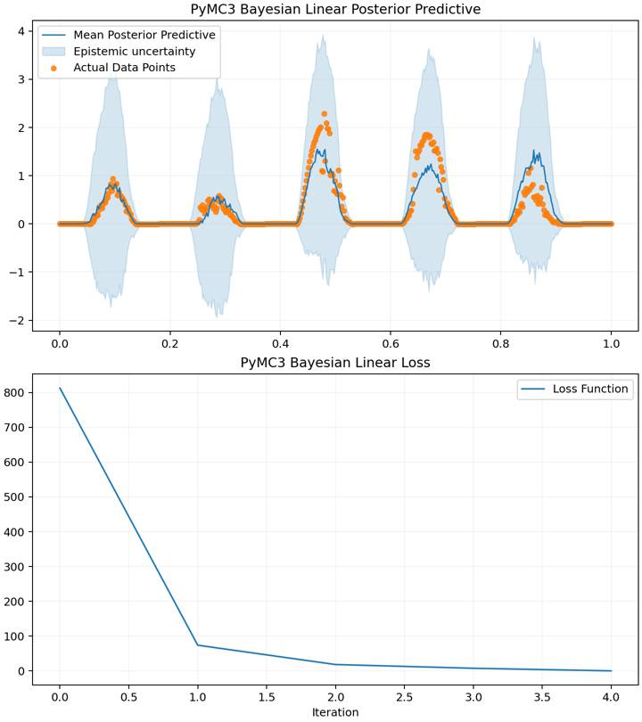
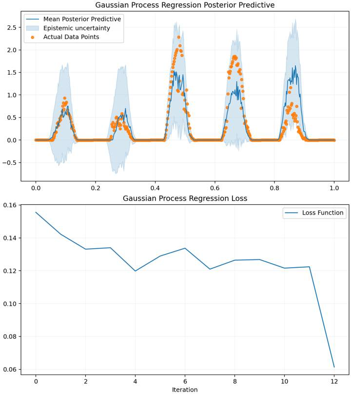

# 基于贝叶斯方法与 GPR 的分布式光伏发电出力预测

本项目用于复现“光伏发电出力预测”数据集上的建模实验。原仓库主要由两个 notebook 组成，结构不够清晰；现在已将 notebook 逻辑整理为 Python 源码，并统一放入 `src/`，便于维护、复现和继续扩展。

## 数据集来源


数据来源于 **2024 数字中国创新大赛（Digital China Innovation Contest, DCIC 2024）数据要素赛道** 中的“光伏发电出力预测”赛题。截图中可以看到该赛题属于算法赛，组织单位为数字中国建设峰会组委会，报名人数为 1105。

该任务面向分布式光伏发电场景，要求结合光伏用户基础信息、气象变量和历史实际功率数据，预测测试集中每个光伏用户每天 96 个 15 分钟时间点的出力值。仓库中的 `data/` 目录保留了训练集、测试集和提交样例 CSV 文件。

## 项目结构

```text
.
├── data/                                  # 训练集、测试集和提交样例
├── outputs/                               # 结论图片、模型文件和预测结果
│   ├── dataset_source.png                 # 数据来源截图
│   ├── gpr_training_process.png           # GPR 训练过程图
│   └── pymc3_training_process.png         # PyMC3/Bayesian 训练过程图
├── src/pv_fault_diagnosis/
│   ├── data.py                            # 数据读取、展开、特征工程、提交文件生成
│   ├── gpr_model.py                       # GPR 模型，对应原 GPR_final.ipynb
│   ├── pymc3_model.py                     # PyMC3 风格贝叶斯线性模型，对应原 pymc3 notebook
│   ├── reproduce.py                       # 统一复现实验入口
│   └── visualization.py                   # 训练过程和预测不确定性绘图
├── requirements.txt
└── README.md
```

## 模型说明

是的，原始代码中实际上有两条模型路线：

- **GPR 模型**：来自 `GPR_final.ipynb`，现在整理为 `src/pv_fault_diagnosis/gpr_model.py`，使用 `GaussianProcessRegressor` 进行多输出预测。
- **PyMC3/Bayesian 模型**：来自 `pymc3_final_linear-Copy2.ipynb`，原 notebook 依赖 PyMC3/Theano。由于这套依赖对现代 Python 版本不友好，当前可复现代码采用 `BayesianRidge` 实现同类贝叶斯线性回归思路，并整理为 `src/pv_fault_diagnosis/pymc3_model.py`。

GPR 的计算复杂度较高，脚本默认抽取 80 个训练日用于 GPR 复现和绘图；如果机器性能允许，可以通过 `--max-gpr-train-samples` 调大样本数。

两个模型都会输出：

- 预测提交文件：`outputs/{model}_submission.csv`
- 模型文件：`outputs/{model}_model.joblib`
- 训练过程图：`outputs/{model}_training_process.png`

## 结论图

### PyMC3/Bayesian 模型



### GPR 模型



每张图分为上下两部分：

- 上半部分为 posterior predictive 风格图：蓝线表示预测均值，浅蓝色区域表示不确定性区间，橙色点表示验证集真实值。
- 下半部分为 loss 曲线：用于观察模型拟合过程中或诊断过程中的误差变化趋势。

## 环境安装

推荐使用 Python 3.10 或更高版本。

```bash
python -m venv .venv
source .venv/bin/activate
pip install -r requirements.txt
```

也可以使用 conda：

```bash
conda create -n pv-bayes python=3.10
conda activate pv-bayes
pip install -r requirements.txt
```

## 复现命令

快速烟测，同时跑两个模型并生成图片：

```bash
PYTHONPATH=src python -m pv_fault_diagnosis.reproduce --quick
```

只运行 GPR：

```bash
PYTHONPATH=src python -m pv_fault_diagnosis.reproduce --models gpr
```

只运行 PyMC3/Bayesian 路线：

```bash
PYTHONPATH=src python -m pv_fault_diagnosis.reproduce --models pymc3
```

完整运行两个模型：

```bash
PYTHONPATH=src python -m pv_fault_diagnosis.reproduce --models all
```

如果只想生成预测文件和模型，不生成图片：

```bash
PYTHONPATH=src python -m pv_fault_diagnosis.reproduce --no-plot
```

## 已修复的复现问题

- 将原 notebook 逻辑整理为 `src/` 下的 Python 模块。
- 修复 Windows 风格路径，如 `data\xxx.csv`。
- 去掉 `xxx.csv` 这类硬编码输出名，统一写入 `outputs/`。
- 使用每行样本自己的日期展开 `p1` 到 `p96`，避免所有样本共享一个错误的全局起始日期。
- 训练集和测试集特征先对齐再归一化，避免列不一致。
- 对缺失特征和缺失标签做稳健处理，避免训练过程直接报错。
- 为两个模型都生成训练过程图，并将结论图片写入 README。

## 数据文件

`data/` 目录应包含以下 GBK 编码 CSV 文件：

- `A榜-训练集_分布式光伏发电预测_基本信息.csv`
- `A榜-训练集_分布式光伏发电预测_气象变量数据.csv`
- `A榜-训练集_分布式光伏发电预测_实际功率数据.csv`
- `A榜-测试集_分布式光伏发电预测_基本信息.csv`
- `A榜-测试集_分布式光伏发电预测_气象变量数据.csv`
- `A榜-测试集_分布式光伏发电预测_实际功率数据.csv`
